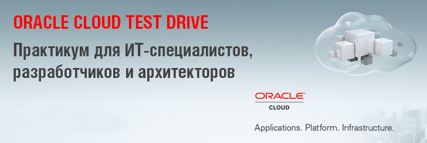

---
# ORACLE Cloud Test Drive #

## Введение ##

Этот проект Oracle Cloud содержит материалы для лабораторных работ Oracle Cloud Test Drive. Участники практикума могут экспериментировать с  рядом облачных сервисов Oracle от семейства IaaS и PaaS.  

В течение  дня вы  сможете протестировать несколько сервисов Oracle Cloud, освоите интерфейс, узнаете, как настраивать средства интеграции, разрабатывать приложения, и все это в непринужденной и увлекательной обстановке.Специальных знаний не требуется.Ниже вы найдете ссылку на все имеющиеся лабораторные работы : 

## Разработка приложений ##
+ [AppDev Infrastructure](AppDev/AppDevInfra.md) - Настройте инфраструктуру для запуска приложений: создайте серверы баз данных и приложений, используя DBaaS или JCS, или используйте Docker Container, чтобы развернуть любой контейнер из репозитория Docker
+ [AppDev Development](AppDev/Develop.md) - Создание приложений с помощью методологии DevOps: использование Developer Cloud Service для создания приложения Spring Boot и его развертывание в облачном сервисе Application Container
+ [DevStar Lab](https://github.com/oracledevstar/microserviceworkshop/blob/master/instructions/clonecode.md) - Присоединитесь к команде повстанцев, совместно создайте набор Микросервисов  и победите приложение DevStar
+ [Разработайте приложнение с MAX](http://docs.oracle.com/cd/E65774_01/tutorials/tut_mcs_max_short/tut_mcs_max_short_1a.html) - Разработайте мобильное приложение с помощью утилиты Mobile Application Accelerator (MAX) из Mobile Cloud Service

## Контейнеры - нативная среда для запуска облачных приложений ##
+ [CI/CD с Wercker : Установите  (Node.js-MongoDB) контейнерное приложение с использованием  Werckers pipe ](AppDev/container/wercker.md)
+ [Запустите свою первую безсерверную функцию, используя FnProject](AppDev/functions/readme.md)

## Инфраструктура как Сервис ##
Перенесите любые рабочие нагрузки в облако для мгновенного повышения производительности с помощью сервисов Oracle Compute Cloud Service и Storage Cloud. В этом разделе приведены некоторые шаги из различных лабораторных работ по CI/CD, c ориентацией на IaaS сервисы, вы ознакомитесь с сервисами:
+ Compute CS
+ Container CS

[Следуйте по этой ссылке для получения подробной информации.](IaaS/readme.md)

## Process Cloud Service ##
Расширьте возможности бизнес-процессов, охватывающих и облако, и локальную систему. В этой работе вы создадите бизнес-процесс с помощью PCS. Процесс утверждения заказа будет инициирован, когда пользователь введет заказ.
[Следуйте по этой ссылке для получения подробной информации.](Process/readme.md)

## Интеграция ##

+ [Integration Cloud Service](Integration/readme.md) - 
Интегрируйте приложения SaaS с локальной системой. Эта лабораторная работа покажет вам, как настроить интеграцию между двумя системами, просто используя функции drag & drop в Integration Cloud Service. В этом упражнении мы настроим интеграцию между экземпляром RightNow и  REST сервисом для мобильного приложения

+ [API Platform Cloud Service](Integration/APIPCS-Manager.md) - 
Управляйте всем жизненным циклом своих API-интерфейсов от описания до промышленной эксплуатации. Цель этой лабораторной работы ознакомиться с Oracle API Platform Cloud Service как гибрибридным средством защиты программных интерфейсов - API Management. 

## Пререквизиты ##

Во время практикума потребуются учетные записи Oracle Cloud, они будут переданы вам во время проведения мероприятия. Для начала работы над этими упражнениями вам понадобится следующая информация :

+ Oracle Cloud account **username** and **password**
+ Oracle Cloud **identity domain**
+ **Data center/region**

В качестве альтернативы вы можете запросить пробную учетную запись Oracle PaaS. Для получения учетной записи обратитесь [сюда](common/request.for.trial.md).

